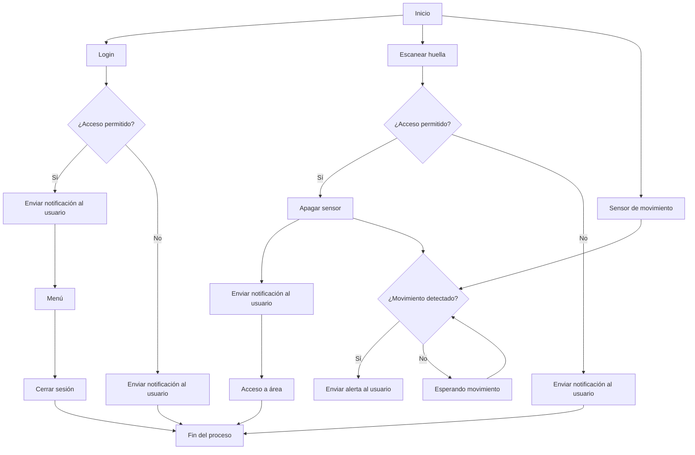

```mermaid
graph TD;
    A[Inicio] --> B[Login];
    B --> N{¿Acceso permitido?};
    N -->|Sí| O[Enviar notificación al usuario];
    O --> C[Menú];
    C --> L[Cerrar sesión] --> M[Fin del proceso];
    N -->|No| P[Enviar notificación al usuario];
    P --> M;
    A --> R[Escanear huella];
    R --> S{¿Acceso permitido?};
    S -->|Sí| T[Apagar sensor];
    T --> U[Enviar notificación al usuario];
    U --> V[Acceso a área];
    V --> M;
    S -->|No| X[Enviar notificación al usuario];
    X --> M;
    A --> Y[Sensor de movimiento];
    Y --> Z{¿Movimiento detectado?};
    Z -->|Sí| AA[Enviar alerta al usuario];
    Z -->|No| AB[Esperando movimiento];
    AB --> Z; 
    T--> Z;
```